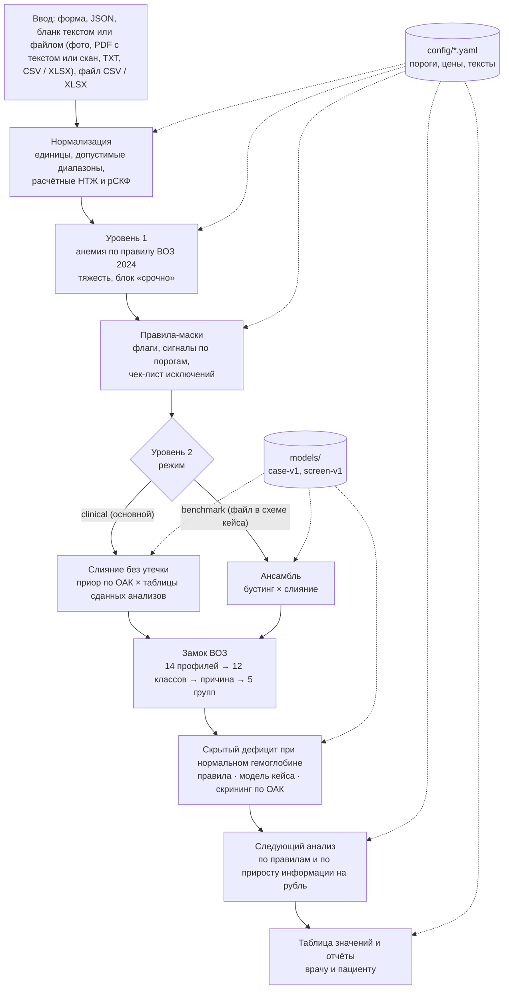
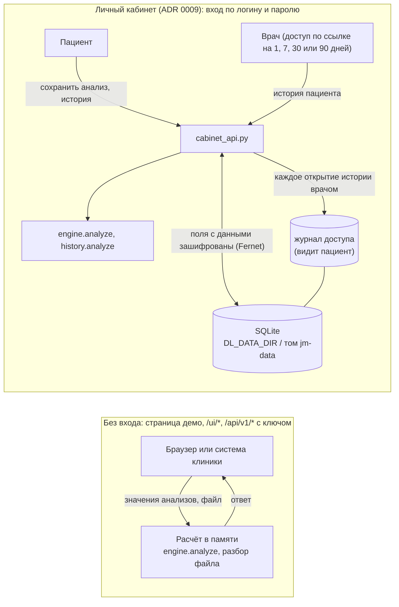

# Архитектура Justmedit

Justmedit — веб-сервис и библиотека (пакеты кода — `deficitlens_*`, это техническое имя). На входе пол, возраст
и значения анализов. На выходе: есть ли анемия по ВОЗ, группа и причина, сигналы скрытого дефицита, что досдать
и два отчёта — врачу и пациенту. Без входа сервис ничего не хранит; в личном кабинете (ADR 0009) анализы
пациента хранятся в зашифрованной базе SQLite.

Документ описывает то, что есть в коде. Чего нет — перечислено в `docs/limitations.md`.

## Конвейер



То же списком. Порядок соответствует функции `engine.analyze`.

1. **Ввод.** Форма на странице, JSON в API, бланк одного анализа (вставленный текст или файл: фото, PDF любой
   лаборатории с текстом или скан, TXT, CSV / XLSX — сначала в таблицу сверки, затем в расчёт; фото и скан
   распознаёт локальный Tesseract, OCR есть в Docker-версии) или файл CSV / XLSX в схеме кейса или своей
   структуры (столбцы сопоставляются на шаге «Столбцы», `POST /api/v1/columns`).
2. **Нормализация** (`normalize.py`). Коды и синонимы показателей приводятся к каноническим. Единицы
   пересчитываются по `config/analytes.yaml`. Значение за жёсткой границей — ошибка 422. Значение за мягкой
   границей принимается с пометкой. Если можно, считаются НТЖ и рСКФ (CKD-EPI 2021).
3. **Уровень 1** (`level1.py`). Анемия по правилу ВОЗ 2024: гемоглобин ниже 120 г/л у женщин и ниже 130 г/л
   у мужчин; при беременности — пороги по триместрам. Тяжесть и блок «срочно». Модель этот вывод не меняет.
4. **Правила-маски** (`rules.py`). Флаги под ситуации, где показатель обманывает: ферритин под маской
   воспаления, нормальный MCV при высоком RDW, микроцитоз не от железа, чек-лист исключений при анемии
   без найденного дефицита («Дефицит по сданным анализам не найден — чек-лист исключений»), низкое НТЖ при
   нормальном ферритине («возможен функциональный дефицит железа»). Правила не меняют класс. Они дают флаги,
   сигналы и список анализов. Решения по спорным правилам — `docs/review/medic_decisions.md`.
5. **Уровень 2** (`ml/case_model.py`). Вероятности 14 профилей в одном из двух режимов (см. ниже).
   Затем «замок ВОЗ»: профили, несовместимые с выводом уровня 1, обнуляются. Затем свёртки: 14 профилей →
   12 классов → причина → 5 групп кейса.
6. **Скрытый дефицит** (`engine.py`, функция `_hidden`). Только при нормальном гемоглобине и вне беременности.
   Три источника сигнала:
   - правила: измеренное значение ниже порога из `config/norms_ru.yaml` (например, ферритин ниже 15 мкг/л);
   - модель кейса: вероятность любого дефицита по сданным анализам вне ОАК;
   - скрининг (`ml/screen.py`): вероятность низкого ферритина по одному ОАК, если ферритин не сдан.
7. **Следующий анализ** (`next_test.py`). Сначала ферритин по результату скрининга, затем анализы,
   обязательные по правилам, затем анализы с наибольшим ожидаемым приростом информации на рубль.
   Цены — из `config/prices.yaml`.
8. **Таблица значений и отчёты** (`values_table.py`, `references.py`, `reports/`). Для каждого значения — статус,
   порог и его источник; «норма» — референс проекта по умолчанию или референс лаборатории (с бланка, из запроса
   или из набора врача в кабинете). Отчёт врачу и отчёт пациенту собираются из шаблонов `config/texts_ru/`.
   Текст пациента проходит фильтр запрещённых слов.

При беременности выполняются только шаги 1–3 и отчёты. Уровень 2, скрининг, флаги и чек-лист выключены.

## Пакеты и файлы

```
src/deficitlens_core/          ядро: не зависит от веб-сервера
  engine.py                    конвейер одного анализа и пакета записей
  schemas.py                   схемы входа и выхода (AnalysisInput, AnalysisResult)
  constants.py                 порядок признаков, группы анализов, профили, свёртки
  config.py                    загрузка config/*.yaml
  normalize.py                 единицы, диапазоны, расчётные НТЖ и рСКФ
  level1.py                    анемия по ВОЗ, тяжесть, блок «срочно»
  rules.py                     флаги, сигналы, чек-лист, обязательные анализы
  next_test.py                 что досдать и сколько это стоит
  values_table.py              таблица значений с порогами и источниками
  references.py                референсы («норма»): проекта по умолчанию, лаборатории, с бланка; предупреждение врачу
  history.py                   анализ всей истории пациента: ряды показателей, события, полнота картины (ничего не хранит)
  reports/                     отчёт врачу, отчёт пациенту
  io/table.py                  пакетная расшифровка CSV / XLSX в схеме кейса
  io/text_parser.py            разбор текста бланка (вставленного, извлечённого из PDF или распознанного с фото)
  io/lab_blank.py              общие помощники бланка любой лаборатории: названия, единицы, нормы, дата анализа
  io/lab_tables.py             таблицы PDF-бланка любой лаборатории → значения, единицы, нормы
  io/pdf_text.py               текст и таблицы PDF в дочернем процессе с таймаутом; скан → картинки страниц
  io/photo_ocr.py              фото и скан → строки текста (локальный Tesseract в дочернем процессе)
  ml/features.py               матрица признаков, правило и «замок» ВОЗ, уровень полноты панели
  ml/fusion.py                 клинический режим: слияние без утечки
  ml/ensemble.py               режим бенчмарка: бустинг × слияние
  ml/case_model.py             загрузка и вызов модели case-v1
  ml/screen.py                 модель screen-v1, стандартизация, справочник лаборатории
  ml/train_*.py, evaluate_*.py обучение и проверка обеих моделей
  cli.py                       командная строка

src/deficitlens_api/           веб-слой
  service.py                   слой сервиса: функции «словарь → словарь», без веб-фреймворка
  app.py                       маршруты Starlette, /api/v1/openapi.json
  security.py                  ключ API, лимит запросов, слоты тяжёлых расчётов, пределы размера, заголовки, журнал
  settings.py                  настройки из переменных окружения
  store.py                     хранилище кабинета: SQLite, поля с данными зашифрованы Fernet, журнал доступа врачей
  auth.py                      пароли (scrypt), токены и сессии (в базе только SHA-256), cookie, CSRF
  cabinet_api.py               маршруты кабинета: /api/v1/auth/*, /me/*, /shares/accept, /doctor/*
  templates/                   страницы: главная, «Проверить на своём файле», API, вход, кабинет, ссылка врача
  static/                      скрипты и стили страниц (без внешних ресурсов), openapi.json, шрифты, Leaflet,
                               список пунктов лабораторий
    app.js, export.js          главная: форма, сверка бланка, результат; выгрузка DOCX и PDF
    benchmark.js               «Проверить на своём файле»: столбцы, режим, расчёт
    cabinet.js                 вход, регистрация, кабинет пациента и врача, принятие ссылки врачом
    home-cabinet.js, nav.js    «Сохранить в кабинет» на главной; вход и роль в шапке
    developers.js              страница «API» (/developers): консоль запросов, примеры кода, справочник

config/                        пороги, показатели, цены, сопоставление классов, тексты отчётов
models/case-v1, screen-v1      обученные модели и metadata.json
data/demo/examples.json        восемь придуманных примеров
data/demo/example_case.csv     три придуманные строки в схеме кейса (запасной файл для демо)
```

Зависимость одна и в одну сторону: `deficitlens_api` вызывает `deficitlens_core`. Ядро о веб-слое и о хранилище
не знает: `history.py` получает записи уже расшифрованными и возвращает словарь.

## Два режима уровня 2 и зачем их два

В учебном наборе кейса набор назначенных анализов подсказывает класс. Например, витамин B6 измерен
у 83 % строк своего класса и у 8–18 % остальных. Модель, которая видит только «сдан / не сдан»,
даёт точность 0,254 при 0,137 у самого частого класса (`docs/pitch/NUMBERS.md`).

Обычный бустинг на всех столбцах эту подсказку выучит: пропуск в столбце для него — признак.
На другом наборе, где анализы назначают иначе, такая модель ошибётся.

**Клинический режим (`clinical`) — основной.** Слияние без утечки (`ml/fusion.py`):

```
вероятность профиля ∝ приор(ОАК, возраст, пол)^t × ∏ по группам ( ∏ по сданным анализам P(бин | профиль) )^w
```

- приор — бустинг только по ОАК, возрасту и полу: они заполнены у всех;
- каждый сданный анализ вне ОАК даёт множитель из таблицы «вероятность бина при данном профиле»;
- несданный анализ множителя не даёт. Ответ зависит только от сданных значений, а не от того,
  какие анализы назначены. Отсутствие ключа, `null` и пустая строка дают один и тот же ответ.

Этот режим работает на странице, в `/api/v1/analyze` и `/api/v1/batch`.

**Режим бенчмарка (`benchmark`).** Ансамбль (`ml/ensemble.py`): геометрическое среднее вероятностей бустинга
на всех признаках и слияния. Бустинг видит, какие анализы сданы, и подсказкой пользуется. Режим нужен,
чтобы на файле в схеме кейса показать результат, сравнимый с тем, что получат другие команды.

**Режим `auto`** в пакетной расшифровке включает режим бенчмарка, только если в файле не меньше 30 принятых
строк и средняя доля сданных анализов на строку лежит в пределах 0,38–0,58 (в файле кейса она 0,476).
Границы заданы в `config/class_mapping.yaml → auto_mode`. Выбранный режим и причина выбора печатаются в сводке.

Точность обоих режимов — в `docs/model_card.md`. Коротко: на строке как есть режим бенчмарка точнее
(0,919 против 0,849 по 12 классам), на неполной панели точнее и лучше откалиброван клинический.

## Стандартизация ОАК по справочнику лаборатории

Модель скрининга `screen-v1` получает не сырые значения ОАК, а стандартизованные:

```
z = (x − медиана) / (q75 − q25)
```

Медиана и квартили берутся по полу из справочника лаборатории в `config/lab_reference.yaml`.

Зачем. Разные анализаторы дают сдвинутые значения. В NHANES с 2013 года сменился анализатор,
и медиана RDW выросла с 12,5–12,7 до 13,5–13,6 %. RDW — главный признак модели. Модель на сырых значениях
после смены анализатора завышает риск: у женщин 18–49 лет предсказано 0,422 при наблюдаемых 0,289
(ферритин ниже 30). После стандартизации — 0,303 при 0,289. AUC почти не меняется.

Справочник считается по выгрузке ОАК самой лаборатории. Ферритин и метки для этого не нужны:

```bash
deficitlens lab-reference --in cbc_export.csv --name my_lab
```

Имя справочника передаётся в запросе полем `lab_reference`. По умолчанию — `default` (NHANES 2017–2023).

Ограничение: то, что стандартизация снимает сдвиг, проверено на одной смене анализатора внутри NHANES.
Для российской лаборатории это надо проверить на её выгрузке с ферритином.

## Слой сервиса без привязки к фреймворку

`deficitlens_api/service.py` — чистые функции: на входе словарь или байты файла, на выходе словарь.
Ошибка — исключение `ServiceError(status, code, message, field)`.

| Функция | Что делает |
|---|---|
| `health()` | состояние и версии |
| `analyze_one(payload)` | один анализ |
| `analyze_many(records, with_reports, max_records)` | пакет записей |
| `columns_preview(content, filename)` | файл CSV / XLSX → что сервис понял в каждом столбце, догадки, «хватает ли данных» |
| `benchmark(content, filename, mode, mapping)` | файл в схеме кейса или своей структуры (сопоставление `mapping`) → предсказания и сводка |
| `parse_text(text)` | текст бланка → значения для сверки |
| `parse_file(content, filename)` | файл бланка (фото, PDF с текстом или скан, TXT, CSV / XLSX одного анализа) → значения для сверки |
| `reference()` | показатели, пороги с источниками, цены, версии |
| `examples()` | восемь примеров для страницы |

`app.py` только разбирает HTTP-запрос, проверяет ключ и лимиты, вызывает эти функции и превращает
`ServiceError` в ответ с нужным кодом. Поэтому слой можно подключить к другому веб-фреймворку
(например, FastAPI), не меняя логику. Сейчас используется Starlette. Маршруты кабинета (`cabinet_api.py`)
вызывают те же функции движка; хранилище `store.py` синхронное и вызывается из пула потоков.

## Два потока данных: без входа и кабинет



## Что хранится

**Без входа — ничего.**

- База кабинета не открывается и не создаётся: она открывается при первом обращении к кабинету. На диск запросы
  не пишутся.
- Модели и конфигурация загружаются при старте и дальше только читаются.
- Загруженный файл разбирается в памяти. PDF и фото разбираются в дочерних процессах с таймаутом, файл
  передаётся через стандартный ввод; Tesseract кладёт картинку во временный файл только в `/tmp` и сразу его
  удаляет. В контейнере единственный каталог для записи, кроме тома кабинета, — `/tmp` в `tmpfs`, то есть в памяти.
- В памяти процесса между запросами живут только счётчики лимитов: для страницы демо — адрес клиента
  и отметки времени за последнюю минуту; для тяжёлых запросов `/api/v1/*` — первые 16 знаков SHA-256 ключа.
- Браузер ничего не хранит: ни `localStorage`, ни `sessionStorage`, ни cookie из скриптов страницы.

**В кабинете — по согласию при регистрации, до удаления пользователем** (`store.py`, ADR 0009):

- База SQLite `justmedit.db` в `DL_DATA_DIR` (без Docker — `data/app/`, в `.gitignore`; в Docker — том `jm-data`).
  Режимы: WAL, внешние ключи с каскадным удалением, `secure_delete` (удалённое затирается сразу).
- Зашифрованы (Fernet): вход анализа и ответ движка, сводка записи, границы референсов врача. Открыто — то, что
  нужно для поиска и связей: логин, роль, клиника врача, даты, сроки доступа, кто из врачей и когда открывал
  историю (журнал доступа). Пароли — только хэш scrypt, токены и cookie — только SHA-256.
- Ключ — `DL_DATA_KEY` или `DL_DATA_KEY_FILE`; без них ключ создаётся файлом рядом с базой (только для демо).
- Удаление аккаунта (`DELETE /api/v1/me` с паролем) стирает пользователя, записи, ссылки, референсы и журнал
  доступа одной транзакцией.
- Сессия сайта — cookie `jm_session` (за HTTPS — `__Host-jm_session`), HttpOnly, ставит только сервер.

**Журнал запросов** в обоих потоках — время, метод, путь, код ответа, длительность. Тел запросов, значений
анализов, логинов и токенов там нет.

Подробнее — `docs/security.md` («Что сервис не хранит», «Личный кабинет»).

## Как масштабируется

**Расчёты.** Запросы без входа (страница демо, `/ui/*`) и с ключом API (`/api/v1/analyze`, `batch`, `benchmark`,
`columns`, `parse`, `reference`) к базе не обращаются, каждый обрабатывается независимо. Их можно делить между
несколькими копиями (репликами) контейнера за балансировщиком; сессий и «прилипания» клиента к копии не нужно.

**Кабинет — один экземпляр.** Всё, что связано со входом, обращается к базе SQLite одного процесса (одно соединение
под замком): маршруты кабинета, расчёты с токеном `Authorization: Bearer`, расчёт на главной у вошедшего врача
(ему подставляются его референсы). Эти запросы должны приходить в один экземпляр с томом базы. Для нескольких
копий кабинета нужна общая база — PostgreSQL (`docs/roadmap.md`).

Что учесть:

- лимиты запросов и два слота тяжёлых расчётов (batch, benchmark, columns, parse; в кабинете — история и загрузка
  выгрузки) считаются в памяти процесса, то есть отдельно в каждой реплике;
- каждая реплика держит модели в памяти. Пиковая память процесса — в `docs/perf.md`;
- расчёт одного анализа занимает одно ядро. Число одновременных расчётов на реплику ограничено числом ядер;
- размер базы кабинета ограничен `DL_DATA_MAX_MB`, регистрации — `DL_MAX_SIGNUPS_PER_DAY`.

Фактические времена — в `docs/perf.md`. Работа в несколько реплик и нагрузка параллельными запросами
не проверялись.
